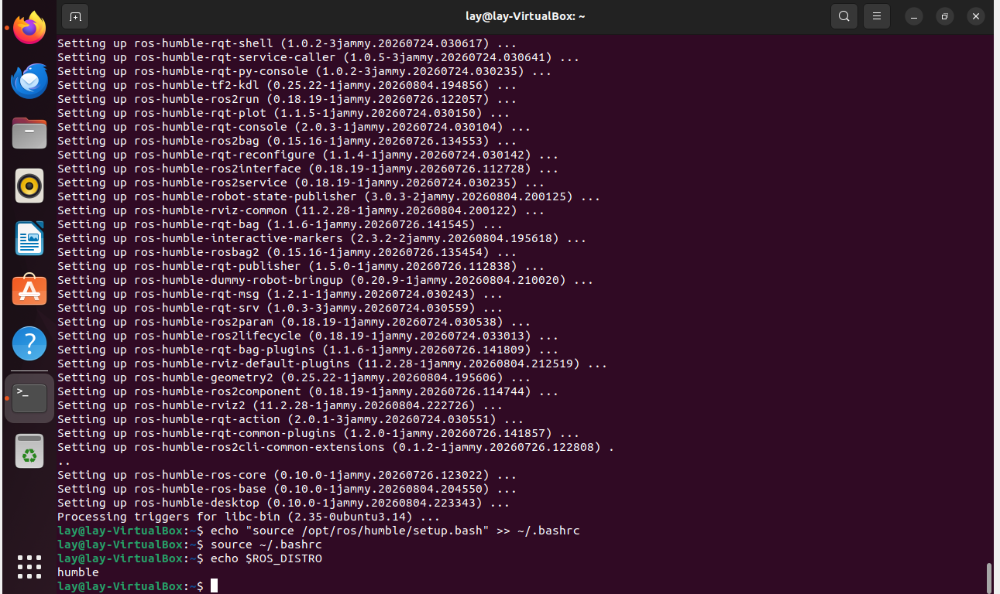

# ROS 2 Humble Installation on Ubuntu 22.04

This project documents the installation of **ROS 2 Humble Hawksbill** on **Ubuntu 22.04 LTS** using **Oracle VirtualBox**.

## Requirements

Before starting, make sure the following are available:

- Oracle VirtualBox
- Ubuntu 22.04 LTS Desktop ISO
- Internet connection
- At least 4 GB RAM for the virtual machine
- 2 CPU cores
- At least 40 GB virtual disk space

## 1. Create a Virtual Machine

Open Oracle VirtualBox and create a new virtual machine.

Recommended configuration:

- **Name:** Ubuntu 22.04
- **Operating System:** Linux
- **Version:** Ubuntu 64-bit
- **Memory:** 4096 MB
- **Processors:** 2
- **Virtual Disk:** 40 GB

Select the Ubuntu 22.04 ISO file as the installation image.

Make sure the virtual machine is stored on a drive with enough free storage space.

## 2. Install Ubuntu 22.04

Start the virtual machine.

Select:

```text
Try or Install Ubuntu
```

Then select:

```text
Install Ubuntu
```

Use the following installation settings:

- Language: English
- Keyboard Layout: English (US)
- Installation Type: Normal Installation
- Download updates while installing Ubuntu: Enabled
- Disk Option: Erase disk and install Ubuntu

The erase option only affects the virtual disk created for VirtualBox.

Continue the installation and create an Ubuntu username and password.

After the installation is complete, restart Ubuntu.

## 3. Open the Terminal

Open the Ubuntu Terminal using:

```text
Ctrl + Alt + T
```

## 4. Update Ubuntu

Update the package list and installed packages:

```bash
sudo apt update && sudo apt upgrade -y
```

Wait until the update process is complete.

## 5. Install Required Packages

Install the required packages:

```bash
sudo apt install software-properties-common curl -y
```

## 6. Add the ROS Repository Key

Run:

```bash
sudo curl -sSL https://raw.githubusercontent.com/ros/rosdistro/master/ros.key -o /usr/share/keyrings/ros-archive-keyring.gpg
```

## 7. Add the ROS 2 Repository

Run:

```bash
echo "deb [arch=amd64 signed-by=/usr/share/keyrings/ros-archive-keyring.gpg] http://packages.ros.org/ros2/ubuntu jammy main" | sudo tee /etc/apt/sources.list.d/ros2.list > /dev/null
```

## 8. Update the Package List

After adding the ROS repository, update Ubuntu again:

```bash
sudo apt update
```

## 9. Install ROS 2 Humble

Install ROS 2 Humble Desktop:

```bash
sudo apt install ros-humble-desktop
```

If the terminal asks:

```text
Do you want to continue? [Y/n]
```

Enter:

```text
Y
```

Wait until the installation is complete.

## 10. Configure the ROS Environment

Add the ROS 2 environment setup to the `.bashrc` file:

```bash
echo "source /opt/ros/humble/setup.bash" >> ~/.bashrc
```

Reload the `.bashrc` file:

```bash
source ~/.bashrc
```

## 11. Verify ROS 2 Installation

Check the installed ROS distribution:

```bash
echo $ROS_DISTRO
```

The expected output is:

```text
humble
```

If `humble` is displayed, ROS 2 Humble has been installed and configured successfully.

## Installation Result

The following screenshot shows the successful ROS 2 Humble installation and verification:


